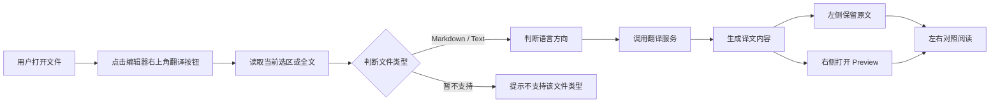

# VS Code Side Translate 插件目标规划

## 1. 项目目标

创建一个简单的 VS Code 插件，用于在编辑器中对当前文件进行中英互译，并以左右对照的方式展示结果。

核心体验：

- 编辑器右上角只有一个翻译按钮。
- 用户点击按钮后，插件读取当前打开的文件或当前选中的文本。
- 插件自动判断原文主要语言，支持中文转英文、英文转中文。
- 插件调用免费或可配置的翻译服务生成译文。
- VS Code 自动分屏，左侧保留原文，右侧显示翻译后的预览内容。
- 右侧译文尽量保持原文格式，适合阅读和对照。

## 2. MVP 范围

第一版只追求可用，不追求支持所有文件类型。

必须实现：

1. 在编辑器右上角显示一个翻译按钮。
2. 点击按钮后读取当前活动编辑器内容。
3. 如果有选区，只翻译选区；如果没有选区，翻译整个文件。
4. 自动判断翻译方向：
   - 中文内容占比较高：中文转英文。
   - 英文内容占比较高：英文转中文。
5. 调用一个翻译服务。
6. 在右侧打开只读预览面板。
7. 支持 Markdown 和纯文本的基础格式保留。
8. 文件修改后不自动重新翻译，需要用户手动重新点击按钮。

暂不实现：

- 实时翻译。
- 多语言自由切换。
- 代码文件的完整语义翻译。
- 翻译结果直接写回原文件。
- 云端账号体系。

## 3. 用户交互流程



## 4. 翻译触发策略

不做实时翻译。

推荐策略：

- 用户主动点击按钮才触发翻译。
- 有选区时优先翻译选区。
- 无选区时翻译整个文件。
- 文件内容发生变化后，右侧预览不自动刷新。
- 后续可以在预览区域增加“重新翻译”按钮。
- 后续可以增加设置项，让用户选择是否在保存时提示重新翻译。

这个策略可以避免以下问题：

- 用户每输入一个字符都触发翻译，造成体验卡顿。
- 免费翻译服务被频繁调用，容易限流。
- 文档较大时重复翻译成本过高。
- 翻译结果不断变化，影响用户阅读。

## 5. 文件格式支持规划

### 第一阶段

优先支持：

- Markdown：`.md`
- 纯文本：`.txt`

Markdown 的处理要求：

- 保留标题层级。
- 保留列表。
- 保留引用块。
- 保留代码块，不翻译代码块内容。
- 保留链接结构，优先翻译链接文本，不破坏 URL。

纯文本的处理要求：

- 保留段落。
- 保留换行。
- 尽量保留缩进。

### 后续阶段

可以继续支持：

- MDX：`.mdx`
- JSON 中的字符串字段。
- 代码文件中的注释。
- 当前选中的任意文本片段。

## 6. 功能模块拆分

| 模块 | 职责 | MVP 是否需要 |
| --- | --- | --- |
| 插件入口 | 激活插件、注册命令、注册按钮 | 是 |
| 命令处理 | 响应点击按钮，协调读取、翻译、预览 | 是 |
| 文档读取 | 获取当前文件、选区、语言 ID、文件路径 | 是 |
| 文件类型判断 | 判断 Markdown、纯文本或暂不支持 | 是 |
| 语言方向判断 | 判断中文转英文或英文转中文 | 是 |
| 翻译服务抽象 | 定义统一翻译接口，方便更换服务 | 是 |
| 翻译服务实现 | 接入免费翻译 API 或本地服务 | 是 |
| 格式保留处理 | 分段翻译，保护 Markdown 结构 | 是 |
| Webview 预览 | 在右侧显示译文 | 是 |
| 缓存 | 文件未变更时复用已有翻译结果 | 建议 |
| 配置项 | 目标语言、服务地址、超时时间等 | 后续 |
| 日志与错误提示 | API 失败、格式不支持、超时等提示 | 是 |

## 7. 推荐技术方案

### VS Code 能力

- 使用 `contributes.menus.editor/title` 在编辑器右上角放置按钮。
- 使用 `commands.registerCommand` 注册翻译命令。
- 使用 `window.activeTextEditor` 获取当前编辑器。
- 使用 `ViewColumn.Beside` 在右侧打开预览。
- 使用 Webview 展示翻译结果。

### 翻译服务

建议先抽象翻译接口，不要把某个免费服务写死。

```ts
interface TranslatorProvider {
  translate(input: {
    text: string;
    source: "zh" | "en" | "auto";
    target: "zh" | "en";
    format: "text" | "markdown";
  }): Promise<string>;
}
```

候选服务：

- MyMemory：适合 MVP 快速验证，但免费额度有限。
- LibreTranslate：适合长期方案，可自托管，隐私更好。

## 8. 推荐项目结构

```text
vscode-side-translate/
  package.json
  tsconfig.json
  src/
    extension.ts
    commands/
      openTranslatePreview.ts
    services/
      detectDocumentType.ts
      detectLanguageDirection.ts
      translation/
        TranslatorProvider.ts
        MyMemoryProvider.ts
        LibreTranslateProvider.ts
    renderers/
      markdownRenderer.ts
      textRenderer.ts
    webview/
      previewHtml.ts
  docs/
    PROJECT_GOAL.md
  test/
```

## 9. 开发阶段拆分

### 阶段 1：插件骨架

- 初始化 VS Code 插件项目。
- 注册翻译命令。
- 在编辑器右上角显示按钮。
- 点击后弹出提示，验证命令可用。

### 阶段 2：基础翻译链路

- 读取当前文件或选区。
- 判断语言方向。
- 接入一个翻译 Provider。
- 在右侧 Webview 显示纯文本译文。

### 阶段 3：Markdown 格式保留

- 识别 Markdown 结构。
- 跳过代码块。
- 分段翻译普通文本。
- 在右侧按 Markdown 预览格式展示。

### 阶段 4：体验优化

- 增加翻译中 loading 状态。
- 增加错误提示。
- 增加手动重新翻译。
- 增加简单缓存。
- 增加插件配置项。

### 阶段 5：扩展能力

- 支持更多文件格式。
- 支持只翻译注释。
- 支持导出双语 Markdown。
- 支持用户自定义翻译服务。

## 10. 主要风险

1. 免费翻译服务可能有限流、不可用或隐私问题。
2. 直接翻译整篇 Markdown 可能破坏格式。
3. 大文件翻译容易超时，需要分段和缓存。
4. 代码文件不适合直接全文翻译，容易破坏语义。
5. 自动判断语言方向可能不准确，需要后续允许用户手动指定。

## 11. 当前建议

先做一个小而完整的 MVP：

1. 只支持 Markdown 和纯文本。
2. 只支持用户手动点击翻译。
3. 只做中英自动方向判断。
4. 右侧只读预览，不写回文件。
5. 翻译 Provider 做成可替换结构。

这个版本完成后，就可以真实使用，再根据体验决定是否增加实时刷新、配置项和更多格式支持。
